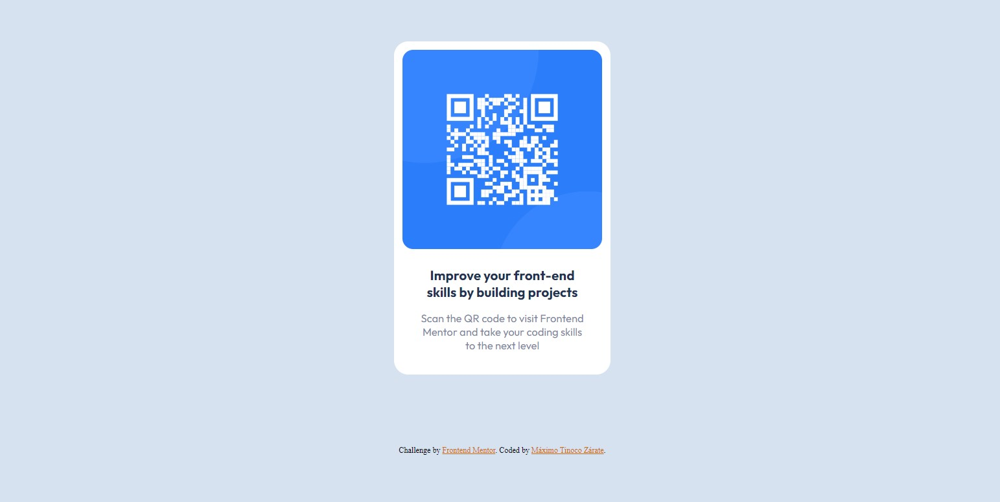

# Frontend Mentor - QR code component solution

This is a solution to the [QR code component challenge on Frontend Mentor](https://www.frontendmentor.io/challenges/qr-code-component-iux_sIO_H). Frontend Mentor challenges help you improve your coding skills by building realistic projects. 

### Screenshot




### Links

- Solution URL: [GitHub-Repository](https://github.com/MaximoTz/Development-of-a-QR-code--Challenge)
- Live Site URL: [Live Sive URL](https://codeqr-public.netlify.app/)


### Built with

- Semantic HTML5 markup
- CSS custom properties
- Flexbox
- CSS Grid
- Mobile-first workflow


### What I learned

I reviewed the use of the h3 tag and was able to recap what it was for
At the same time I was able to repair and see how well I was doing with my css styles

```html
<h3>A tag that caught my attention for its use</h3>
```
```css
.content{
    display: flex;
    flex-direction: column;
    justify-content: center;
    align-items: center;
    background: hsl(0, 0%, 100%);
    font-family: 'Outfit', sans-serif;
    text-align: center;
    width: 280px;
    border-radius: 20px;
    margin: 100px auto;
    padding: 12px;
}
```


### Continued development

I want to focus more on acquiring more knowledge and improving my mobile designs as well as responsive

## Author

- Name - Maximo Tinoco Zarate
- Frontend Mentor - [@MaximoTz](https://www.frontendmentor.io/profile/MaximoTz)


